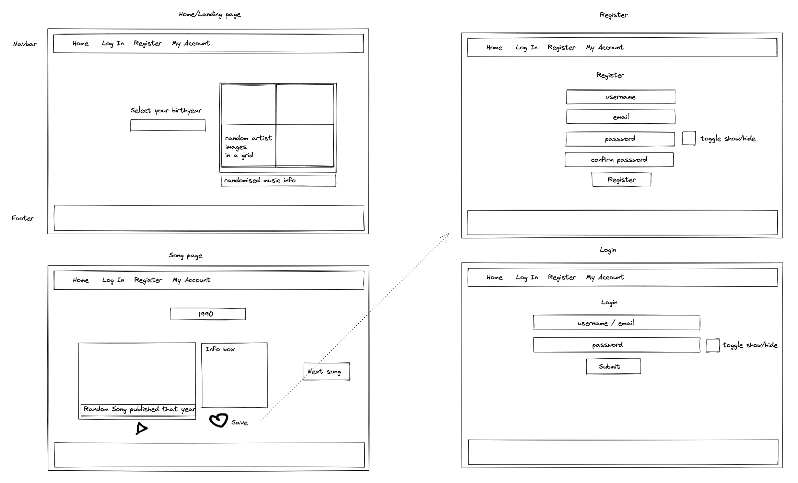

# General Assembly Project Two - React AJAX Requests App

# Project Overview

This was the second project of the General Assembly Software Engineering Immersive course and my first time pair programming which I enjoyed a lot! The project's brief was to create a React app consuming an external API.  I worked in a team of 2 with [Linh Vu](https://github.com/linh-vup) decided to create an application that utilised the Napster API to display a random song with song information and an audio snippet based on a user’s selected year of choice.

Please find the full deployment of the app [here](https://wyndhams-ga-project-2.netlify.app/). 

# Project Brief

The project was set out in the same format as a hackathon. We started on a Thursday and presented our finished project on the following Monday. As a team we worked on the project for 3 full days in total.

## Technical Requirements:
- The application must consume a public API – this could be anything but it must make sense for your project.
- Have several components - At least one classical and one functional.
- The app can have a router - with several "pages", this is up to your discretion and if it makes sense for your project.
- Include wireframes - that you designed before building the app.
- Be deployed online and accessible to the public.

## Necessary Deliverables
- A working application, hosted somewhere on the internet.
- A link to your hosted working app in the URL section of your Github repo.
- A git repository hosted on Github, with a link to your hosted project, and frequent commits dating back to the very beginning of the project.
- A README.md file.

# Getting Started

Clone or download the source code and in the command line run the following commands:
```
npm install
```
```
npm start
``` 

# Technologies Used
- React
- JavaScript (ES6)
- HTML5
- SCSS
- Npm
- Axios
- react-router-dom
- react-notify-toast
- react-datepicker
- Napster API
- Postman
- Git/GitHub
- Bulma
- Excalidraw
- Google Chrome dev tools
- Google Fonts
- Netlify

# Main Features
- Select a year from given range
- Receive random song suggestion
- Play audio snippet
- Receive another random song suggestion from that year


# Planning
Our first task was to research and decide upon a public API for our application to consume. We chose the Napster API with the intention of displaying a random song based on the selected birth year of the user. We registered with Napster to obtain an API key and created mock-ups of how we wanted our application to be structured, and the features we wanted it to have, refer to below wireframe. 



# Build Process

For this project we used React with Axios as the HTTP client for Node.js and the Bulma CSS framework for styling. We worked on our assigned tasks on different git branches while using Slack and Zoom to communicate. My role was to work with the Napster API to fetch the required data and display it on the web pages, whilst my partner ([Linh Vu](https://github.com/linh-vup)) worked on each of the page components and styling. 

Whilst we were working on the project, Napster’s v2.2 albums endpoint (which returned 1000 results when called) stopped returning any results, so we had to quickly adapt our codebase to work with the deprecated 2.0 version. The API had a different design and only returned 200 results as discussed further below. 

The user selects a specific year on the home page using a react-date-picker element that Linh set up. This year is then used as a parameter, which filters through the returned API call results. We encountered issues with the Napster API, as we found out that none of the available endpoints could provide all the information we needed in one call, and we had to create multiple nested API calls. 

```js
const ALBUMS_URL = 'https://api.napster.com/v2.0/albums/top';
const API_KEY = {
  params: { apikey: 'YTY2NzM4ODgtMTdhNi00MWQ5LTkyZDktMmZjODBkYzA4N2Qw' }
};

const getParams = (offset) => ({
  params: {
    limit: 200,
    apikey: 'YTY2NzM4ODgtMTdhNi00MWQ5LTkyZDktMmZjODBkYzA4N2Qw',
    offset
  }
});

export const getAlbums = (offset) => {
  return axios.get(ALBUMS_URL, getParams(offset));
};
```
We also had to create a recursive API call when we found that none of the results included the selected year as a parameter. This was due to the Napster API limiting returned results to 200. I implented this using an if else statement which checks to see whether the returned array has any albums in it. If the returned array is empty i.e. falsey, the data fetch function is called again with an increased offset of 200. This process repeats until the array is populated and a song is randomly selected.

```js
if (albumsByYear.length) {
    ...
} else {
  startDataFetching(offset + 200);
}
```

We set up a Postman collection to have a better overview of all the data returned by the different endpoints and their parameter modifications. From the endpoints, we extracted information on album name, artist, song name, release year, album cover and track snippet mp3, which we then displayed on the Song page component. 

# Styling
We used the Bulma CSS framework for a lot of element stylings (like buttons or cards), we didn’t have sufficient time to finish the styling for the site due to the issues experienced with the API.

# Challenges
Although the Napster API was more challenging to work with than we initially anticipated, it was a good exercise in adapting to changes and working collaboratively to solve problems. We couldn't implement all the features we planned due to the time spent problem-solving. When we were searching for an appropriate API to meet our original idea, i.e. selecting a song from your birthyear, the Napster API appeared to have data for albums going back far enough into the past. However, when the Napster v2.2 API stopped working, the v2.0 endpoint did not have sufficient data, but at this point it was too late to change the root API!

There was also added complexity in the Napster API design, which required us to make multiple API calls where one should have been sufficient if we were using an ideally designed API. Issues included:
- The album endpoint did not contain a released year parameter, but did contain all other info we required.
- The song endpoint did contain a released year but did not contain other information e.g. album artwork that we required for display on our website. 
- The v2.0 endpoint only returned 200 results.

# Highlights & Key Learnings

This process taught me to thoroughly read API documentation and returned data structures prior to commencing with a project idea. Another key learning was the importance of effective communication and collaboration when working on a group project. Pair-programming and using tools like Slack and Zoom helped us to stay on track and work together to solve problems.

- Thoroughly reading API documentation and understanding data structures is essential to the success of a project.
- Effective communication and collaboration are critical when working on group projects. Using tools like Slack and Zoom can help you stay on track and solve problems together.
- Pair-programming is an excellent way to work through difficult coding challenges and learn from others.
- Working with external APIs can be challenging, but it can also be a valuable learning experience.

Overall, this project was a valuable learning experience that gave us the opportunity to work with external APIs and to practice our coding and collaboration skills. While there were challenges along the way, we were able to adapt and come up with creative solutions to meet our project goals. Moving forward, we will be better equipped to approach similar projects and tackle challenges more effectively.

# Future Development

Given the limited timeframe and the difficulties we had with figuring out nesting API calls, we couldn’t implement all the features we planned out and couldn’t invest more time into styling. I have included below some further improvements which could be implemented to the app:
- Refactor code to remove redundant code and console.logs
- Add in a user account page with login and registration functionality. Allow users to favourite certain tracks so they can come back to them at a later date. 
- Change the current Napster API v.2.0 endpoint back to v.2.2 (if it becomes functional again!)
- Explore using a different public API that would return a more diverse range of music rather than returning only the most popular!
- Add a save functionality and either save it in localstorage or create a mini-backend
- Find a way to decrease loading time
- Update the styling and make the home page more responsive